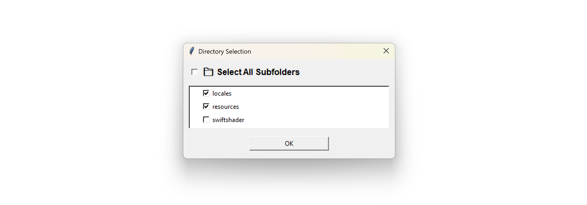

# tkinter-subfolders-select



### What happened

Tkinter does not support the selection of multiple folders out of the box. 


### Solution

This is the implementation of the feature **NO NEED** for any 3rd-party library.

[subfolder_dialog.py](https://github.com/ylli2000/tkinter-subfolders-select/blob/main/subfolder_dialog.py)

### How to Use

Now suppose you have something standard like this:


```python
import tkinter as tk
from tkinter import filedialog
from subfolder_dialog import open_directory_selection_dialog
import ... # any necessary libs

# This is your settings object if needed:
# I have provided you with an optional interface here, in a practical project you should write your settings into a 
# settings.txt as persistent memory to memorize the subfolder you selected last time.
selected_folders_key = 'my_app:selected_folders'
settings = {} 
settings[selected_folders_key] = '' # store the list of subfolders, separated by commas

# link this click function to your button
# params:
#  selected_folders_label: where you display the list of subfolders, separated by commas
#  hint: the title of the dialog box
def browse_folder_click(selected_folders_label, hint):
    folder_path = filedialog.askdirectory(title=hint)
    if folder_path:
        selected_folders = open_directory_selection_dialog(root, settings, selected_folders_key, folder_path)
        if selected_folders and len(selected_folders) > 0:
            selected_folders_label.config(text=", ".join(selected_folders))
            settings[selected_folders_key] = ", ".join(selected_folders)
    root.update()

# ...
root = tk.Tk()
#...
btn_browse = tk.Button(root, text="Select Folder(s):", width=15, command=lambda: browse_folder_click(selected_folders_label, "Select a folder"))
selected_folders_label = tk.Label(root, borderwidth=2, width=150, relief="groove", background="white")
#...
# RUN UI
root.mainloop()
```

Where `open_directory_selection_dialog` is your entrance function. Check out the code from this repository.
